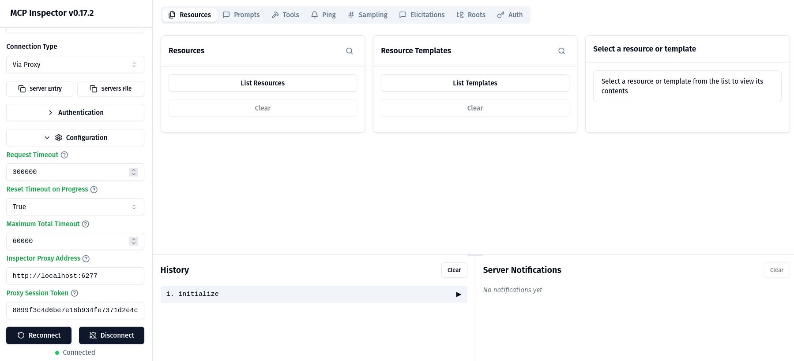
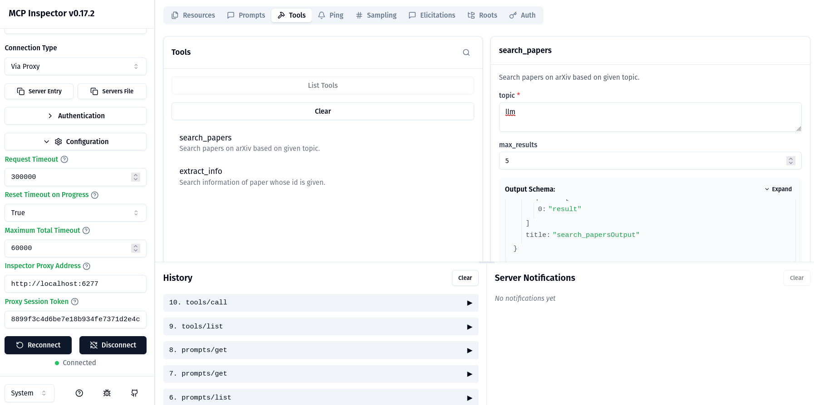

# MCP GitHub Demo

This project demonstrates an MCP (Model Context Protocol) server using FastMCP with SSE transport.

## Setup

1. Install dependencies:

```bash
uv sync
# or
pip install -r requirements.txt
```

## Running the MCP Server

**IMPORTANT**: The MCP server must be running **before** starting the MCP Inspector.

### Start the MCP Server

In one terminal, start the server:

```bash
python mcp_server.py
```

The server will start on `http://localhost:8001` with the SSE endpoint at `http://localhost:8001/sse`.

You should see:

```
Running MCP server...
MCP Server will be available at: http://localhost:8001/sse
Make sure this server is running before starting the MCP Inspector!
```

### Start the MCP Inspector

In another terminal, start the inspector:

```bash
npx @modelcontextprotocol/inspector
```

The inspector will:

- Start a proxy server on `localhost:6277`
- Open a web UI at `http://localhost:6274`





### Why a Proxy Server?

The MCP Inspector uses a **proxy server architecture** because:

1. **Browser Limitations**: The Inspector UI runs in your browser, but browsers cannot directly:

   - Execute stdio-based processes (most MCP servers use stdio transport)
   - Bypass CORS (Cross-Origin Resource Sharing) restrictions
   - Access local file system or spawn processes
2. **Transport Conversion**: The proxy server acts as a bridge that:

   - Connects to MCP servers using various transports (stdio, SSE, HTTP)
   - Converts MCP protocol messages to HTTP/WebSocket for the browser
   - Handles authentication and session management
3. **Architecture Flow**:

   ```
   Browser UI (port 6274)
      ↕ HTTP/WebSocket
   Proxy Server (port 6277)
      ↕ MCP Protocol (stdio/SSE/HTTP)
   Your MCP Server (port 8001)
   ```

The proxy is necessary to enable browser-based inspection of MCP servers that may use transports incompatible with browsers.

### Connecting the Inspector to the Server

The MCP Inspector needs to be configured to connect to your SSE server. Here are the steps:

1. **Start the MCP server first** (in terminal 1):

   ```bash
   python mcp_server.py
   ```
2. **Start the Inspector** (in terminal 2):

   ```bash
   npx @modelcontextprotocol/inspector
   ```
3. **In the Inspector UI**:

   - Look for a "Connect" or "Add Server" button
   - Enter the server URL: `http://localhost:8001/sse`
   - Or use the inspector's connection dialog to add a new SSE server

**Note**: The inspector proxy runs on port 6277, but you need to connect it to your MCP server running on port 8001.

## Troubleshooting

### Error: "Error Connecting to MCP Inspector Proxy"

This error typically means:

1. **The MCP server is not running**: Make sure `python mcp_server.py` is running in another terminal
2. **Port conflict**: Check if port 8001 is already in use
3. **CORS issues**: The server already has CORS middleware configured, but if issues persist, check browser console logs

### Verify Server is Running

Check if the server is accessible:

```bash
curl http://localhost:8001/sse
```

You should get a response (may be an SSE connection attempt).

### Check Server Logs

Look at the terminal where `mcp_server.py` is running for any error messages.

```bash
$ npx @modelcontextprotocol/inspector
Starting MCP inspector...
⚙️ Proxy server listening on localhost:6277
🔑 Session token: 8899f3c4d6be7e18b934fe7371d2e4cdd2dfe13170d6138db4a494d352c3a092
   Use this token to authenticate requests or set DANGEROUSLY_OMIT_AUTH=true to disable auth

🚀 MCP Inspector is up and running at:
   http://localhost:6274/?MCP_PROXY_AUTH_TOKEN=8899f3c4d6be7e18b934fe7371d2e4cdd2dfe13170d6138db4a494d352c3a092

🌐 Opening browser...
New SSE connection request. NOTE: The SSE transport is deprecated and has been replaced by StreamableHttp
Query parameters: {"url":"http://localhost:8001/sse","proxyFullAddress":"http://localhost:6277","transportType":"sse"}
SSE transport: url=http://localhost:8001/sse, headers={"Accept":"text/event-stream"}
Created client transport
Created server transport
Received POST message for sessionId f7c7ff1f-781d-4646-974a-259f9da0b282
Received POST message for sessionId f7c7ff1f-781d-4646-974a-259f9da0b282
...

```

## Server Features

The MCP server provides:

- **Tools**:

  - `search_papers`: Search for papers on arXiv
  - `extract_info`: Extract information about a paper by ID
- **Resources**:

  - `papers://folders`: List available topic folders
  - `papers://{topic}`: Get papers for a specific topic
- **Prompts**:

  - `generate_search_prompt`: Generate a prompt for searching papers
- **Command for updating requirements.txt**

  `uv pip compile pyproject.toml > requirements.txt`
- **Command for github**

  ```bash
  $ git remote add origin https://github.com/tien-le/mcp-arxiv-demo

  $ git remote -v
  ```

## Deployment on Render

https://dashboard.render.com > MONITOR > Logs

```bash
...
==> Deploying...
==> Running 'python mcp_server.py'
INFO:     Started server process [56]
INFO:     Waiting for application startup.
INFO:     Application startup complete.
INFO:     Uvicorn running on http://0.0.0.0:10000 (Press CTRL+C to quit)
Running MCP server...
MCP Server will be available at: http://0.0.0.0:10000/sse
Make sure this server is running before starting the MCP Inspector!
INFO:     127.0.0.1:46312 - "HEAD / HTTP/1.1" 404 Not Found
     ==> Your service is live 🎉
     ==> 
     ==> ///////////////////////////////////////////////////////////
     ==> 
     ==> Available at your primary URL https://mcp-arxiv-demo.onrender.com
     ==> 
     ==> ///////////////////////////////////////////////////////////

```
